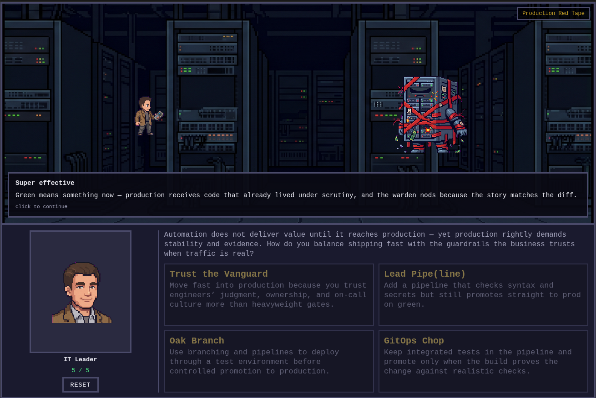

# Ansible Hero

*A short browser quest for anyone who has ever watched automation stall on policy, dependencies, or the gap between “dev” and “prod.”*

[Play it now!](https://bontreger.github.io/ansible-hero/)

## The realm’s plight

Long ago is yesterday in IT years. Your kingdom runs on automation—or it would, if the road were clear. Instead, **blockers** rise like dungeon encounters: locked-down toolchains, wary gatekeepers, tangled dependencies, human queues, red tape around production, ledgers that demand proof, and whispers of new magic that must be tamed. You are not a lone script-kiddie; you are the **leader** who must choose how to answer each trial.

You venture forth to **learn how real teams get stuck** and **what kinds of moves**—named like old RPG strikes—often appear in the wild. The story is a gentle parable, not a lecture: every “attack” sketches a plausible stance, from cautious to bold.

## Why play

Ansible Hero exists to make **automation adoption friction** feel tangible. You will face a **series of trials** and a **final guardian** whose shape shifts with the debate of the hour. Your goal is not to memorize product names—it is to notice **patterns**: when reuse beats purity, when evidence unlocks budget, when pipelines and policy matter more than hope alone.

## How the quest flows

- **Resolve** is your stamina. Some choices cost a measure of it; a **superb** strike may restore a little when fortune favors you.
- Each trial opens with a **situation** and four **approaches**. The order of those approaches **changes each time** you face the menu—trust your read, not muscle memory.
- After you strike, you see **how effective** your approach was. If the spirits call it **not effective** or only **slightly effective**, you may **try the same trial again** or **skip ahead**; when your approach is **effective** or **super effective**, the path forward opens with a single step.
- **Relics** are tokens of especially decisive victories—collect them as you go. The **recap** tells the tale in order: situation, then your approach, then the result.
- When the last gate falls, a **victory** screen gathers your relics and sends you home—until you choose to **begin anew**.

For setup, art pipelines, containers, and how the app behaves under the hood, see **[DEV-README.md](DEV-README.md)**.
